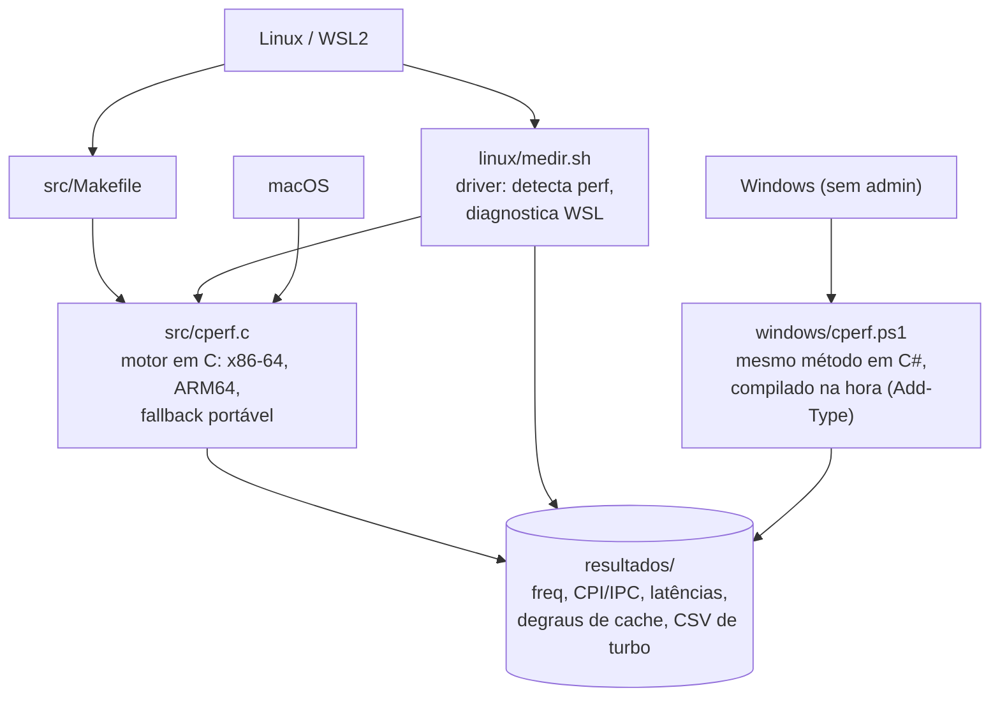
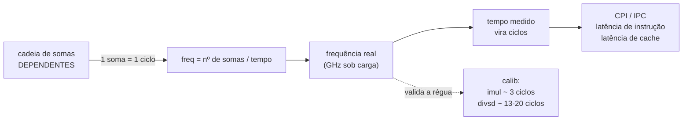

# cperf

`cperf` faz o trabalho do `perf` — ciclos, **CPI/IPC, latência de instrução e de
cache, frequência real** — só que por **cronometragem calibrada**, sem PMU, sem
root e sem administrador. Funciona até em WSL2, onde o `perf` não lê contadores
de hardware. O nome é "C perf": o motor é escrito em C, como o `perf`.

## Estrutura

Cada plataforma tem um ponto de entrada; todos os caminhos terminam no mesmo
motor de medição e produzem os mesmos resultados.



Na raiz ficam os roteiros didáticos: `00-ROTEIRO-PROFESSOR.md` (teoria, roteiro
minuto a minuto, gabarito) e `01-ROTEIRO-ALUNO.md` (folha de laboratório).

## Como funciona

A régua é uma cadeia de somas inteiras **dependentes** (`add reg,reg`): cada soma
custa exatamente 1 ciclo em qualquer x86-64 ou ARM64 moderno. Disso sai a
frequência real e, com ela, todo tempo medido vira ciclos.



Em C (`cperf.c`) a cadeia é assembly inline. No Windows (`cperf.ps1`) o mesmo
efeito vem de compilar C# com `Add-Type` (o JIT emite `add reg,reg`). Se a
premissa não valer na máquina, o subcomando `calib` denuncia.

## Instalação e uso

### Linux / WSL2

```bash
sudo apt update
sudo apt install -y build-essential linux-tools-common linux-tools-generic time
cd src && make && cd ../linux
./medir.sh                     # bateria completa -> linux/resultados/
```

### macOS

Sem `apt`, `perf` ou `taskset`; compila com o `cc` do sistema.

```bash
cd src
cc -O2 -fno-unroll-loops -o cperf cperf.c
./cperf all
```

Em Apple Silicon a frequência oscila (o processo migra entre P-cores e E-cores):
use a mediana de `./cperf freq` e valide com `./cperf calib`.

### Windows (sem administrador)

Não precisa de compilador nem de `.exe` — o script traz o motor em C# e o compila
na hora. Roda em Windows PowerShell 5.1 e PowerShell 7.x.

```powershell
cd windows
Set-ExecutionPolicy -Scope Process -ExecutionPolicy Bypass
.\cperf.ps1                     # bateria completa -> windows\resultados\
```

Em Windows on ARM o JIT mede a cadeia alto demais; o `calib` avisa e recomenda o
`cperf` em C.

### Gerar o `.exe` a partir do WSL

```bash
sudo apt install -y gcc-mingw-w64-x86-64
cd src && make win
```

## Subcomandos

`./cperf <sub>` no Linux/macOS · `.\cperf.ps1 -Teste <sub>` no Windows.
Sem argumento, roda a bateria completa (`all` no C, `tudo` no PowerShell).

| Subcomando     | Mede                                              |
| -------------- | ------------------------------------------------- |
| `info`         | CPU, relógios e caches declarados pelo SO         |
| `freq`         | frequência real do núcleo sob carga               |
| `calib`        | valida o método contra latências conhecidas       |
| `ilp`          | CPI/IPC com 1, 2, 4 e 8 cadeias independentes     |
| `lat`          | latência em ciclos por tipo de instrução          |
| `mem`          | latência por nível de cache (8 KiB a 128 MiB)     |
| `matriz [N]`   | percurso por linha vs. por coluna (N padrão 2048) |
| `ladder [s]`   | frequência ao longo do tempo, em CSV              |
| `all` / `tudo` | bateria completa                                  |

## Licença

Material didático. Uso livre para fins educacionais, com atribuição.
Maciel, Ronierison — CESAR School.
